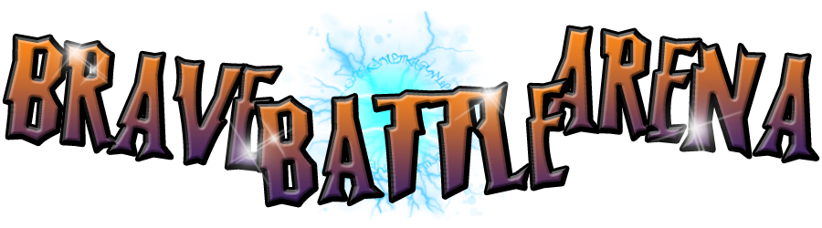
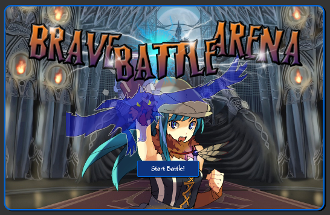
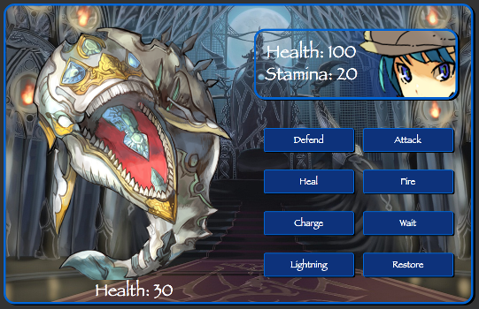

#Brave Battle Arena

####Javascript RPG
-

##Story
Assume the role of Akari, a powerful sorceress, as she tackles the trials of the Dark Labyrinth in hopes of fame and riches.

This is a class JRPG combat style game, where you and your opponent trade turns using distinct skills till one suceeds, and spoils are taken. This game continues so long as Akari is alive. (Health > 0)

##Your Stats:
NAME: Akari

LEVEL: Your current level

HEALTH: Your current Health, if 0 you loose

STAMINA: Your current Stamina, needed for non-defensive Skills

ARMOR: Your base Armor, Lowers enemy Attack Dammage

ARMOR MOD: Additional Armor when you use Defend Skill

EXP: Your current level of experence, awarded by defeating enemies.

NEXT LV: Amount of EXP needed to level up.

##Your Skills:
###Offensive:
ATTACK:  (Stamina Cost = 1) Damage enemy based on random number and your Strength Stat.

FIRE: (Stamina Cost = 5) Attack dammage x 5

LIGHTNING: (Stamina Cost = 15) Attack dammage x 10

###Devensive:
WAIT: Restore 10 Stamina

DEFEND: Raise Armor by ArmorMod and increase Stamina by 1

CHARGE: Restore all Stamina, recieve 2X enemy dammage

###Restoritive
HEAL: (Stamina Cost = 10) Heals 50 health

RESTORE: (Stamina Cost = 25) Heals all health

##Level UP!
You level up when your Exp is greater than your Next Level Stat.

####Stats Increased:
HEALTH + 15

STRENGTH + 2

STAMINA + 2

ARMOR + 1
 
##Enemies
You will battle opponents one at a time, Once defeated a new enemy will appear. Your encounters will be randomized, and with each enemy defeated, their level will increase, and their stats improved.

###Enemy List
GOUL: Average Health, Average Strength, Average Exp Awarded.

WASP: Weak Health, Weak Strength, Low Exp Awarded.

WHYVERN: Low Health, High Strength, Average Exp Awarded.

STALION: Moderate Health, Very High Strength, Very High Exp Awarded.

SKY WHALE: Very High Health, Low Strength, High Exp Awarded.

DARKNESS: HIGH Health, High Strength, High Exp Awarded.

CHEST: Attack to break open, Award with a random Item. 

##Items
Items are randomly given when a "Chest" enemy is distroyed. They all improve your stats and give you a better chance for victory!

###Item List
DAGGER: Strength + 2

SWORD: Strength + 4

AXE: Strength + 6

HELMIT: ArmorMod + 2

SHIELD: ArmorMod + 4

BREASTPLATE: ArmorMod + 6

HEALTH CRYSTAL: Health + 15

STAMINA SHARD: Stamina + 5

LUCK CHARM: Lower Enemy LV

MAGIC TOME: Free Level Up

#Developement
I was inspired by classic Japaneese Role Playing Games, (Final Fantasy, Pokemon, Kyle's Quest) which have a distinct combat systems that involve selecting a command from a list to perform during their turn. 

With that in mind I experamented with creating object keys for stats and keys with "commands" to affect other objects, then logging the result. Along with that console loging some dialogue and with that having a bare bones console version of Brave Battle Arena.

With the game play, I wanted a combat system that forces the player to plan their move ahead instead of spamming attack and relying on random generation. With that in mind I used stamina as a means to limit player input. Most skills require stamina to perform, otherwise the move cannot be done, and the player needs to use their turn to recharge their stamina rather than attack. In the final product there are 3 moves that do this, whith each having different effects. The timing of when to use these is vital. 

The game is rather simple in concept, The player performs a function which alters enemy stats then the enemy performs a function in response. The effects depend on the function given. However what became apparent was the emmense size of the variables involved. A huge part was keeping data clean, and trying to find efficient means to code. I reduced all player functions to one master move function, doing dammage calculations on a separate function and, using jQuery to handle event listeners. This all helped reduce the number of lines. However, Due to the large amount of data needed to be checked and updated the game was still well over 400 lines of code. My final solution was to separate game into 3 separate js files, one for the games model(data), one for the state(the game itself), and one final for the render(visuals/audio).

On that note the visuals was by far the most problematic. My idea was to incorperate fades as a basic animation to use for attack effects, and enemy effects. Meaning when the data will be processed became a major point in the developement. The use of callbacks were important, but sometimes even that still did not give the desired effect. For example the Defense ability needs to raise the player's armor by its armor mod before the enemy attacks, but then needs to revert back after enemy attack is over, but before the player sets his next input, and definatly before the render of the player stats. For this case I used a timeout function.

## Developed in:
HTML

Javascript

CSS

####Additional Libraries:
jQuery

Animate CSS

##Design:

##Credits:
Programing: Adrian (Ishmaru)

Illustrated 2D Monsters + Characters from jewels-s-free art: [http://www.jewel-s.jp/]

Magic Effects made using Photoshop brushes from Obsidian Dawn [http://www.obsidiandawn.com/]

Various sounds are from Open Game Art [http://opengameart.org]

###Special Thanks:
General Assembly

Everyone form Class: Wdi-Down Town LA 10!

